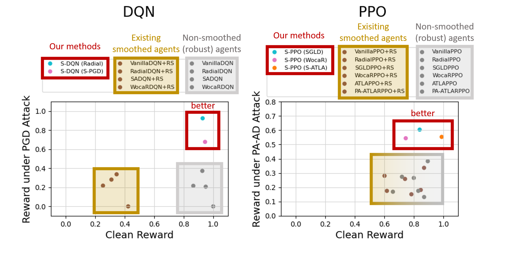
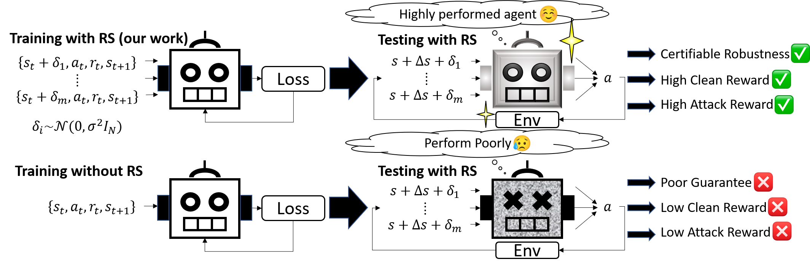

# Smoothed Robust DRL Agents with Enhanced Utility and Robustness
This is the official repository for the ICML 2024 paper: [**Breaking the Barrier: Enhanced Utility and Robustness in Smoothed DRL Agents**](https://arxiv.org/abs/2406.18062).

## Motivation
* Recently, there is a growing interest on enabling certifiable robustness in DRL agents using Randomized Smoothing (RS), transforming agents into their *smoothed* counterparts during testing. **Unfortunately, we found that existing smoothed agents (in brown color) demonstrate a notable deficiency**: they yield **substantially lower clean reward** and **little improvement in robustness** compared to their non-smoothed counterparts (in grey color).

* To address the limitations, in this work we introduce the first robust DRL training algorithms utilizing Randomized Smoothing. Our agents (S-DQN and S-PPO, in red boxes) achieved state-of-the-art performance in clean reward, robust reward, and robustness guarantee, outperforming the existing smoothed agents by 2.16× and non-smoothed robust agents by 2.13× under the strongest attack.


<p align="center">
  
</p>

## Overview
<p align="center">
  
</p>
Our code is based on [SADQN](https://github.com/chenhongge/SA_DQN) and [SAPPO](https://github.com/huanzhang12/SA_PPO). We used the [auto_Lirpa](https://github.com/Verified-Intelligence/auto_LiRPA) library for computing convex relaxations of neural networks.
First, clone our repository. There will be two folders for our SDQN and SPPO implementation.

## S-DQN (Smoothed - Deep Q Network)
<p align="center">
  
</p>

### Setup
```
cd SDQN
git clone https://github.com/KaidiXu/auto_LiRPA
cd auto_LiRPA
git checkout f4492caea9d7f1e6bcee52e70dbcda6b747f43da
python setup.py install
cd ..
pip install -r requirements.txt
```
### Pretrained Models
Our pretrained models can be found in `models/`.
We set the smoothing variance sigma to 0.1 for Pong, 0.1 for Freeway, and 0.05 for RoadRunner.
### S-PGD Attack
To test S-DQN (Vanilla) against S-PGD attack with budget epsilon=0.01 in the Pong environment, run
```
python test_attack_denoiser.py --config config/Pong_denoiser.json test_config:m=100 test_config:sigma=0.1 test_config:smooth=true test_config:max_frames_per_episode=50000 test_config:attack_config:params:epsilon=0.01 test_config:attack_config:norm_type=l_inf test_config:num_episodes=5 training_config:use_async_env=false
```
Switch the config to  `Pong_rad_denoiser.json` to evaluate S-DQN (Radial), and `Pong_denoiser_adv.json` to evaluate S-DQN (S-PGD).
Set `test_config:attack_config:norm_type=l_2` to switch L-infinity attack to L-2 attack. `sigma=0.1` is the smoothing variance (should be set to 0.1 for Pong, 0.1 for Freeway, and 0.05 for RoadRunner), `m=100` is the number of Monte Carlo samples, and `epsilon=0.01` is the attack budget.
### S-PA-AD attack
To test S-DQN (Vanilla) against S-PA-AD attack with budget epsilon=0.01 in the Pong environment, first train an S-PA-AD attacker
```
python paad_train_attacker.py --config config/Pong_denoiser.json --sigma 0.1 --epsilon 0.01 --algo ppo --num-steps 64 --lr 5e-4 --use-linear-lr-decay --clip-param 0.1 --num-env-steps 1000000
```
then, attack the agents with the trained attacker
```
python paad_evaluate_attack.py --config config/Pong_denoiser.json --sigma 0.1 --epsilon 0.01 --attacker paad --log-interval 1000 --cuda-deterministic > ./Pong_denoiser_eps_0.01.txt
```
Switch the config to  `Pong_rad_denoiser.json` to evaluate S-DQN (Radial), and `Pong_denoiser_adv.json` to evaluate S-DQN (S-PGD).
### Certified radius
To evaluate the average certified radius of S-DQN (Vanilla), run
```
python certify_r_denoiser.py --config config/Pong_denoiser.json test_config:m=100 test_config:sigma=0.1 test_config:smooth=true test_config:max_frames_per_episode=500 test_config:num_episodes=1
```
Switch the config to  `Pong_rad_denoiser.json` to evaluate S-DQN (Radial), and `Pong_denoiser_adv.json` to evaluate S-DQN (S-PGD).
### Reward lower bound
To evaluate the reward lower bound of S-DQN (Vanilla), run
```
python test_attack_denoiser.py --config config/Pong_denoiser.json test_config:m=1 test_config:sigma=0.1 test_config:smooth=true test_config:max_frames_per_episode=50000 test_config:attack_config:params:epsilon=0.0 test_config:attack_config:norm_type=l_inf test_config:num_episodes=1000 training_config:use_async_env=false
```
and then, run
```
python reward_bound.py
```
Switch the config to  `Pong_rad_denoiser.json` to evaluate S-DQN (Radial), and `Pong_denoiser_adv.json` to evaluate S-DQN (S-PGD).
### Training
To train S-DQN (Vanilla) in Pong environment, run
```
python train_denoiser.py --config config/Pong_denoiser.json
```
Switch the config to  `Pong_rad_denoiser.json` to evaluate S-DQN (Radial), and `Pong_denoiser_adv.json` to evaluate S-DQN (S-PGD).
The result will be save to `PongNoFrameskip-v4_denoiser_0.1`. You can find the denoiser model with the name `denoiser_frame_300000.pth`, and the original DQN model used for training denoiser `dqn_frame_300000.pth`.

## S-PPO (Smoothed - Proximal Policy Optimization)
<p align="center">
  
</p>

### Setup
```
cd SPPO
git clone https://github.com/KaidiXu/auto_LiRPA
cd auto_LiRPA
git checkout 389dc72fcff606944dca0504cc77f52fef024c4e
python setup.py install
cd ..
pip install -r requirements.txt
```
Then, follow the instructions [here](https://github.com/openai/mujoco-py#install-mujoco) to install mujoco
### Pretrained Models
Our pretrained models can be found in `median_models/`. We report the median result of the 15 models while testing.
Note that PPO learning algorithms have large variances across different training runs. For a fair comparison, it is necessary to train each environment at least 15 times and report the median reward among the 15 agents.
The 15 agents for every algorithm can be also found in `models/`.
We set the smoothing variance sigma to 0.2 for Walker, 0.3 for Hopper, and 0.4 for Humanoid during the training.
### Clean reward, MAD Attack, min-RS attack
```
cd src
```
To test the clean reward of S-PPO (Vanilla) in the Walker environment, run
```
python test.py --config-path config_walker_sppo.json --load-model median_models/walker_sppo_median.model --deterministic
```
To test the clean reward of the state-of-the-art S-PPO (SGLD) in the Walker environment, run
```
python test.py --config-path config_walker_sppo_sgld.json --load-model median_models/walker_sppo_sgld_median.model --deterministic
```
To attack S-PPO with MAD(Maximal Action Difference) attack and min-RS(robust Sarsa) attack in the Walker environment, run
```
source scan_attacks.sh
scan_attacks median_models/walker_sppo_median.model config_walker_sppo.json sarsa_walker_sppo
```
To evaluate other agents, change the model name and config name. For example, `median_models/walker_sppo_sgld_median.model` will evaluate S-PPO (SGLD).
The implementation of S-PPO (WocaR) is in the `src_wocar/` folder, and S-PPO (S-PA-ATLA) is in the `src_pa_atla/` folder.
### Optimal attack
```
cd optimal_attack
```
To attack S-PPO with the Optimal attack in the Walker environment, first train the optimal attacker
```
cd configs
# This will generate 216 config files inside agent_configs_attack_ppo_ant.
python attack_sppo_walker_scan.py
cd ..
# This command will run 216 configurations using all available CPUs. 
python run_agents.py configs/agent_configs_attack_sppo_walker_scan/ --out-dir-prefix=configs/agents_attack_sppo_walker_scan > attack_sppo_walker_scan.log
```
After finishing training the attacker, run the script to attack
```
bash example_evaluate_optimal_attack.sh
```
Need to change the line
```
scan_exp_folder <config file> <path to trained optimal attack adversarial> <path to the victim agent model> $semaphorename
```
Parse the results
```
python parse_optimal_attack_results.py configs/agents_attack_sppo_walker_scan/attack_sppo_walker/agents
```
To evaluate other agents, change the corresponding command. For example, `python attack_sppo_sgld_walker_scan.py` will evaluate S-PPO (SGLD).
### PA-AD attack
```
cd pa_ad
```
To attack S-PPO with the PA-AD attack in the Walker environment, first train the PA-AD attacker
```
cd configs
# This will generate 216 config files inside agent_configs_attack_ppo_ant.
python attack_sppo_walker_scan.py
cd ..
# This command will run 216 configurations using all available CPUs. 
python run_agents.py configs/agent_configs_attack_sppo_walker_scan/ --out-dir-prefix=configs/agents_attack_sppo_walker_scan > attack_sppo_walker_scan.log
```
After finishing training the attacker, run the script to attack
```
bash example_evaluate_paad_attack.sh
```
Need to change the line
```
scan_exp_folder <config file> <path to trained paad attack adversarial> <path to the victim agent model> $semaphorename
```
Parse the results
```
python parse_paad_attack_results.py configs/agents_attack_sppo_walker_scan/attack_sppo_walker/agents
```
To evaluate other agents, change the corresponding command. For example, `python attack_sppo_sgld_walker_scan.py` will evaluate S-PPO (SGLD).
### ADIV
To get the ADIV S-PPO (Vanilla) in the Walker environment, run
```
python test.py --config-path config_walker_sppo.json --load-model median_models/walker_sppo_median.model --deterministic
```
To evaluate other agents, change the model name and config name. For example, `median_models/walker_sppo_sgld_median.model` will evaluate S-PPO (SGLD).
### Reward lower bound
To evaluate the reward lower bound of S-PPO in the Walker environment, run
```
python test.py --config-path config_walker_sppo.json --load-model median_models/walker_sppo_median.model --num-episodes 1000 --testing-m 1 --deterministic
```
and then, run
```
python reward_bound.py
```
To evaluate other agents, change the model name. For example, `median_models/walker_sppo_sgldmedian.model` will evaluate S-PPO (SGLD).
### Training
To train S-PPO (Vanilla) in the Walker environment, run
```
python run.py --config-path config_walker_sppo.json
```
To train other agents, change the config name. For example, `config_walker_sppo_sgld.json` will train S-PPO (SGLD).
The implementation of S-PPO (WocaR) is in the `src_wocar/` folder, and S-PPO (S-PA-ATLA) is in the `src_pa_atla/` folder.

## Cite this work
Chung-En Sun, Sicun Gao, Tsui-Wei Weng. "Breaking the Barrier: Enhanced Utility and Robustness in Smoothed DRL Agents". ICML 2024
```
@article{robustRSRL,
   title={Breaking the Barrier: Enhanced Utility and Robustness in Smoothed DRL Agents},
   author={Chung-En Sun and Sicun Gao and Tsui-Wei Weng},
   journal={ICML},
   year={2024}
}
```
