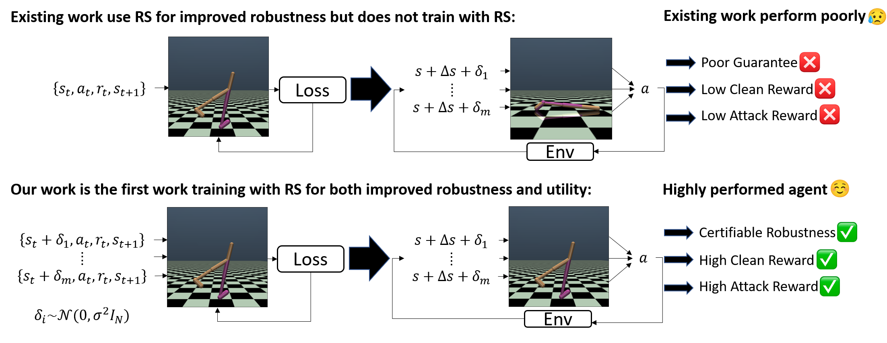

# Smoothed Robust DRL Agents with Enhanced Utility and Robustness
This is the official repository for the ICML 2024 paper: **Breaking the Barrier: Enhanced Utility and Robustness in Smoothed DRL Agents**.

## Motivation
* Recently, there is a growing interest on enabling certifiable robustness in DRL agents using Randomized Smoothing (RS), transforming agents into their *smoothed* counterparts during testing. **Unfortunately, we found that existing smoothed agents (in brown color) demonstrate a notable deficiency**: they yield **substantially lower clean reward** and **little improvement in robustness** compared to their non-smoothed counterparts (in grey color).

* To address the limitations, in this work we introduce the first robust DRL training algorithms utilizing Randomized Smoothing. Our agents (S-DQN and S-PPO, in red boxes) achieved state-of-the-art performance in clean reward, robust reward, and robustness guarantee, outperforming the existing smoothed agents by 2.16× and non-smoothed robust agents by 2.13× under the strongest attack.


<p align="center">
  
</p>

## Overview
<p align="center">
  
</p>

## S-DQN (Smoothed - Deep Q Network)
<p align="center">
  
</p>

## S-PPO (Smoothed - Proximal Policy Optimization)
<p align="center">
  
</p>

## Cite this work
Chung-En Sun, Sicun Gao, Tsui-Wei Weng. "Breaking the Barrier: Enhanced Utility and Robustness in Smoothed DRL Agents". ICML 2024
```
@article{robustRSRL,
   title={Breaking the Barrier: Enhanced Utility and Robustness in Smoothed DRL Agents},
   author={Chung-En Sun, Sicun Gao, Tsui-Wei Weng},
   journal={ICML},
   year={2024}
}
```
